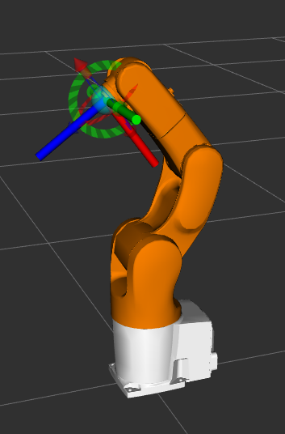
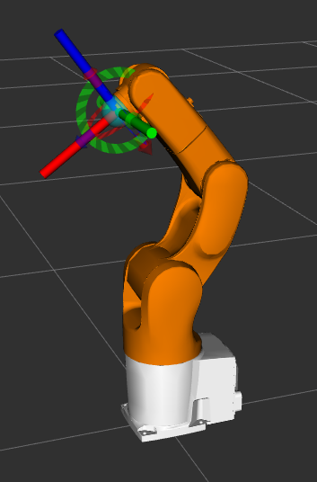

# Frame Conventions

This document describes the frame and orientation conventions used across the DENSO robot description and tooling packages. All robot and tool frames must follow these conventions to ensure consistent behavior in visualization, simulation, and motion planning.

## Coordinate Convention

Frames use the following axis orientation:

- **+X** points forward (red)
- **+Y** points left (green)
- **+Z** points up (blue)

This applies to the robot's base frame.

## Frame Naming

All robots follow a consistent naming convention:

- `base_link` — the robot's base frame
- `J{i}` — link frames (e.g. `J1`, `J2`, ..., `J6`)
- `joint_{i}` — joint frames connecting the links (e.g. `joint_1`, ..., `joint_6`)

> **NOTE**: `flange` and `tool0` frames — used as the attachment point for tools, as described in [Adding Custom Tools](adding_custom_tools.md) — are currently only available on the **VS-050** robot.

### `tool0`

The `tool0` frame is an all-zeros tool frame located at the robot's end-effector, identical to the tool frame defined by the industrial controller.

> **NOTE**: `tool0` uses the following axis orientation:
> - **+X** points down
> - **+Y** points left
> - **+Z** points forward

| *tool0 frame* |
|:--:|
|  |

### `flange`

The `flange` frame is an attachment point for tools on end-effector and following same axis orientation of robot's base frame.

| *flange frame* |
|:--:|
|  |

## Related Documentation

- [Adding Custom Tools](adding_custom_tools.md)